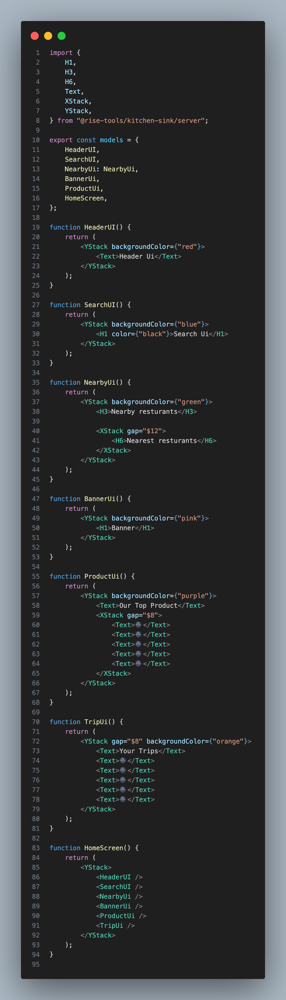
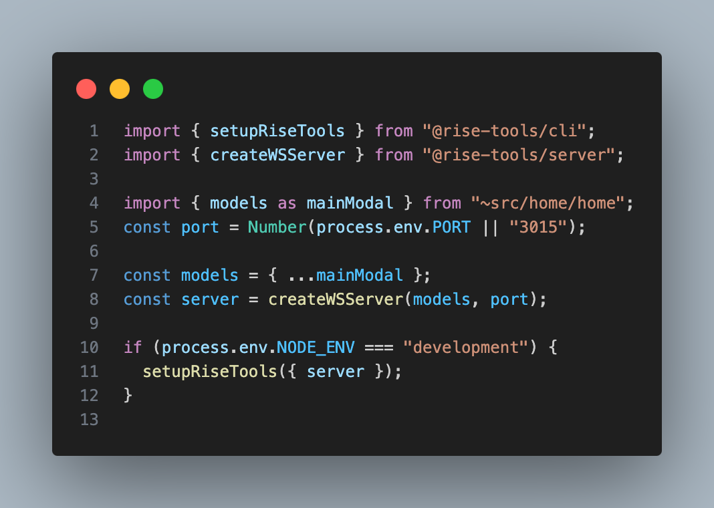

# Playground Template

Welcome to Rise!

To start your server, run:

```sh
$ npm run dev
```

This project includes all of Rise Kit and works inside Rise Playground out of the box. To learn more, [check out our docs!](https://rise.tools/docs/playground/#building-for-playground)

# RISE SERVER

## 🚀 Introduction

This repository contains the client-side implementation for Server-Driven UI (SDUI) development using Rise Tools. It's designed to seamlessly update React Native applications, providing dynamic UI components that can be updated in production without rebuilding or redeploying your app.

## 🎯 What You'll Learn

1. Core principles of component-driven development
2. Harnessing Storybook UI to enhance your development workflow
3. Bootstrapping a React Native project with Tailwind
4. Seamlessly integrating Storybook UI into your Expo project
5. Crafting and showcasing reusable components
6. Industry best practices for component-driven development

## 🛠 Prerequisites

Before diving in, make sure you have:

- A basic understanding of JavaScript, Typescript and React Native
- Node.js and npm installed on your development machine
- Make sure you have completed the [React Native - Environment Setup](https://reactnative.dev/docs/environment-setup) instructions
- A basic knowlwdge of Tamagui

## 📚 Tutorial Sections

1. **Introduction to Server-Driven Development**
   - What it is
   - When to use it
2. **Setting Up Your Expo Project**
3. **Creating Your Rise Server**
   - File and Folder Setup
   - Creating HomeScreen Model
4. **Creating Your Rise Client React Native**
   - File and Folder Setup
   - Integrating HomeScreen Model from server
   - Creating Various Button Stories
   - Writing Jest Tests for the Button Component
5. **DYnamic update from server**
   - Crafting a TextInput with Tailwind CSS
   - Creating a Default TextInput Story
   - Creating Various TextInput Stories
   - Writing Jest Tests for the TextInput Component
6. **Hosting server on Render**
7. **Productioin Server link and app build**
8. **Dynamic testing**

## Getting started

To create a rise server, run `npm create rise@latest`

### Setting up Server for Home screen

<!-- ```javascript
import {
	H1,
	H3,
	H6,
	Text,
	XStack,
	YStack,
} from "@rise-tools/kitchen-sink/server";

export const models = {
	HeaderUI,
	SearchUI,
	NearbyUi: NearbyUi,
	BannerUi,
	ProductUi,
	HomeScreen,
};

function HeaderUI() {
	return (
		<YStack>
			<Text>Header Ui</Text>
		</YStack>
	);
}

function SearchUI() {
	return (
		<YStack>
			<H1>Search Ui</H1>
		</YStack>
	);
}

function NearbyUi() {
	return (
		<YStack>
			<H3>Nearby resturants</H3>

			<XStack gap="$12">
				<H6>Nearest resturants</H6>
			</XStack>
		</YStack>
	);
}

function BannerUi() {
	return (
		<YStack>
			<H1>Banner</H1>
		</YStack>
	);
}

function ProductUi() {
	return (
		<YStack>
			<Text>Our Top Product</Text>
			<XStack gap="$8">
				<Text>🌚</Text>
				<Text>🌚</Text>
				<Text>🌚</Text>
				<Text>🌚</Text>
				<Text>🌚</Text>
			</XStack>
		</YStack>
	);
}

function TripUi() {
	return (
		<YStack gap="$8">
			<Text>Your Trips</Text>
			<Text>🌚</Text>
			<Text>🌚</Text>
			<Text>🌚</Text>
			<Text>🌚</Text>
			<Text>🌚</Text>
		</YStack>
	);
}

function HomeScreen() {
	return (
		<YStack>
			<HeaderUI />
			<SearchUI />
			<NearbyUi />
			<BannerUi />
			<ProductUi />
			<TripUi />
		</YStack>
	);
}
``` -->



This component divides the Homescreen into different components `HeaderUi` , `SearchUi`, `NearbyUi`, `BannerUi`, `ProductUi`, `TripUi`. These can be used singularly in the mobile/client side, or can be used in conjucture as the `HomeScreen`. Using the main HomeScreen in the client app, we have the power to rearrange the structure dynamically from the server

### Setting Up server.ts

```javascript
import { setupRiseTools } from "@rise-tools/cli";
import { createWSServer } from "@rise-tools/server";

import { models as mainModal } from "~src/home/home";
const port = Number(process.env.PORT || "3015");

const models = { ...mainModal };
const server = createWSServer(models, port);

if (process.env.NODE_ENV === "development") {
	setupRiseTools({ server });
}
```

<!--  -->

### Setting up mobile app to connect to server

1. To quick start your application you can clone this base repo thats setup with Expo, expo router, Tamagui, and rise tools.

   `git clone git@github.com:rise-tools/rise-mobile-quickstart.git`

2. Manual set Up
   `npx create-expo-stack@latest react-native-rise-sdui-mobile --expo-router --tamagui` to set up your project with tamagui and expo router

   - install the following dependencies `@rise-tools/kit-expo-router` `@rise-tools/kitchen-sink` `@rise-tools/react` `@rise-tools/ws-client` `expo-haptics`

   - Create `modelSource.ts`, this defines the connection to the WebSocket server created by in the server repository:

   ```Typescript
       `modalSource.ts`
       import { createWSModelSource } from "@rise-tools/ws-client";

       export const modelSource = createWSModelSource("ws://192.168.0.213:3015");

   ```

   - Create `riseActions.ts`, this defines the local action library for the app:

   ```Typescript
       `riseActions.ts`
       import { useExpoRouterActions } from "@rise-tools/kit-expo-router";
       import {
           useHapticsActions,
           useLinkingActions,
           useToastActions,
       } from "@rise-tools/kitchen-sink";

       export function useRiseActions() {
           return {
               ...useHapticsActions(),
               ...useLinkingActions(),
               ...useToastActions(),
               ...useExpoRouterActions(),
           };
       }

   ```

   - Create `riseComponents.ts`, this defines the local component library for the app:

   ```Typescript

       import {
           FormComponents,
           LucideIconsComponents,
           QRCodeComponents,
           RiseComponents,
           SVGComponents,
           TamaguiComponents,
           } from '@rise-tools/kitchen-sink';

       export const components = {
           ...FormComponents,
           ...LucideIconsComponents,
           ...QRCodeComponents,
           ...RiseComponents,
           ...SVGComponents,
           ...TamaguiComponents,
           };

   ```

   - Run app with `yarn ios` or `yarn android` or `yarn start` to open with expo on your phisican device

   
