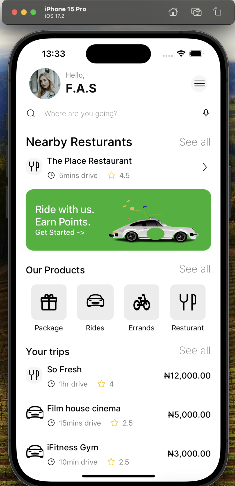
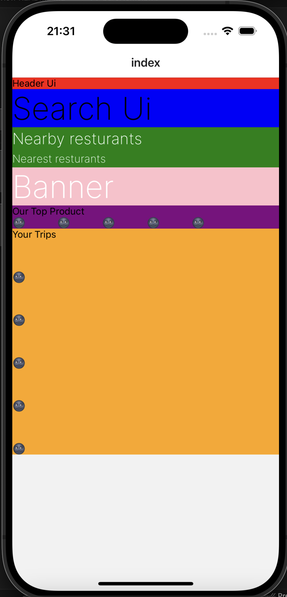
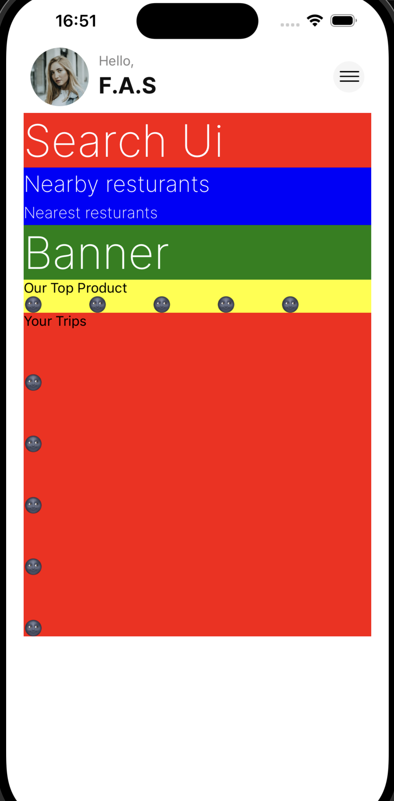
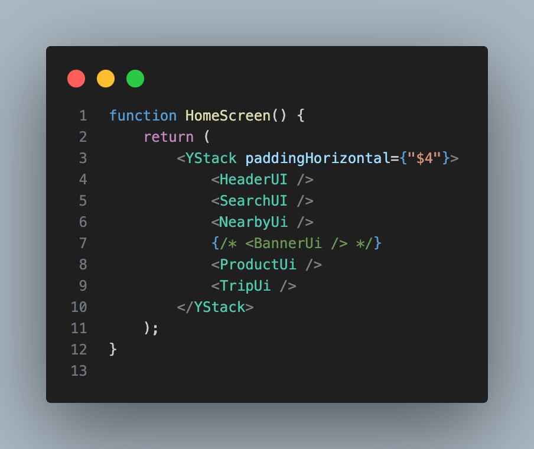
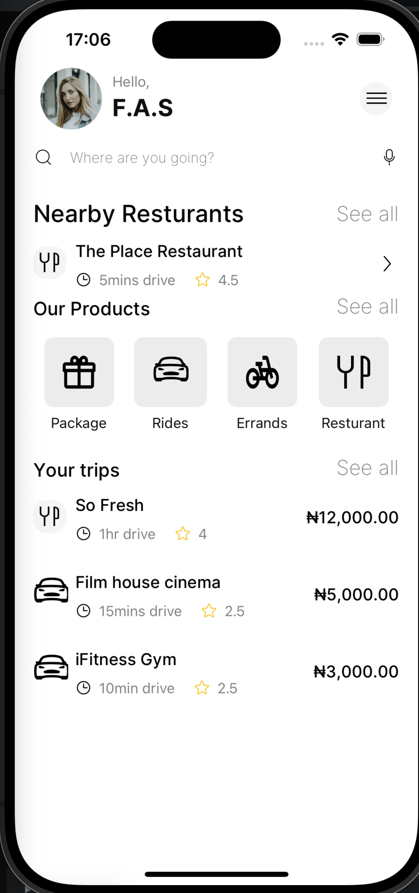

# Rise Server-Driven UI Project

## 🚀 Introduction

This repository contains the implementation for Server-Driven UI (SDUI) development using Rise Tools. It's designed to seamlessly update React Native applications, providing dynamic UI components that can be updated in production without rebuilding or redeploying your app.

## 🎯 What You'll Learn

1. Core principles of Server Defined Rendering for React Native
2. Server Defined Rendering VS OTA updates Vs Update Prompts
3. Rise Tools Architecture
4. Creating Server side
5. Creating Client side app
6. Building mobile app for installation
7. Deploying backend server and using it to update the mobile app

## 🛠 Prerequisites

Before diving in, make sure you have:

- A basic understanding of JavaScript, Typescript and React Native
- Node.js and npm installed on your development machine
- Make sure you have completed the [React Native - Environment Setup](https://reactnative.dev/docs/environment-setup) instructions
- A basic knowlwdge of Tamagui

## 📚 Tutorial Sections

1. **Introduction to Server-Driven Development**

- Definition and core concepts of Server-Driven UI (SDUI)
- Benefits and use cases for SDUI
- Real-world examples of apps utilizing SDUI and their success stories

2. **Setting Up Rise Server**

- Project setup & folder structure
- Server configuration and initialization
- Creating Base HomeScreen Model

3. **Setting Up Your Expo Project**

- Cloning existing expo template
- Creating a new Expo project
- Essential configurations and dependencies
- Integrating the HomeScreen model from the server

5. **Updating React Native Application with Server update**
6. **Deploying the Server to Production**
7. **Dynamic React Native App Updates from Server**
8. **Building and Testing the Mobile App for Production**

## Introduction to Server-Driven Development

Definition and core concepts of Server-Driven UI (SDUI):
SDUI is an architectural pattern where the server defines and controls the user interface of a client application. Instead of hardcoding UI elements in the client, the server sends a UI specification (often in JSON format) that the client interprets and renders. This approach allows for dynamic UI updates without requiring app updates.

### Key concepts include:

- UI specification: A structured description of the interface layout and components
- Client-side renderer: A component that interprets the specification and creates native UI elements
- Dynamic updates: The ability to change the UI by modifying the server-side specification

### Benefits and use cases for SDUI:

1. Flexibility: Easily update UI without app store releases
2. Consistency: Maintain a uniform experience across platforms
3. A/B testing: Quickly test different layouts or features
4. Personalization: Tailor UI based on user segments or behaviors
5. Rapid iteration: Implement UI changes faster
6. Feature flags: Enable or disable features remotely
7. Reduced app size: Some UI logic moves to the server

## Setting Up Rise Server

We will work with this UI focusing on creating a server-side UI and implementing it in a React Native application. Follow the tutorial sections to build your SDUI-powered app step by step.

   

### Setting Up Rise Server

To create a new Rise server project, follow these steps:

1. Open your terminal.
2. Run the following command:
   `npm create rise@latest`

   ```
   my-rise-project/
   ├── node_modules
   ├── src/
   │ ├── models.tsx
   │ ├── server.ts
   ├── package.json
   ├── tsconfig.json
   └── README.md
   ```

### Setting Up `server.ts`

```javascript
import { setupRiseTools } from "@rise-tools/cli";
import { createWSServer } from "@rise-tools/server";

import { models as mainModal } from "~src/home/home"; // import models from `Homescreen.tsx`
const port = Number(process.env.PORT || "3015");

const models = { ...mainModal };
const server = createWSServer(models, port);

if (process.env.NODE_ENV === "development") {
	setupRiseTools({ server });
}
```

### Setting up Server for Home screen

Create a `HomeScreen.tsx` file in your preferred directory, and let's get started.

```javascript
import {
	H1,
	H3,
	H6,
	Text,
	XStack,
	YStack,
} from "@rise-tools/kitchen-sink/server";

export const models = {
	HeaderUI,
	SearchUI,
	NearbyUi: NearbyUi,
	BannerUi,
	ProductUi,
	HomeScreen,
};

function HeaderUI() {
	return (
		<YStack>
			<Text>Header Ui</Text>
		</YStack>
	);
}

function SearchUI() {
	return (
		<YStack>
			<H1>Search Ui</H1>
		</YStack>
	);
}

function NearbyUi() {
	return (
		<YStack>
			<H3>Nearby resturants</H3>

			<XStack gap="$12">
				<H6>Nearest resturants</H6>
			</XStack>
		</YStack>
	);
}

function BannerUi() {
	return (
		<YStack>
			<H1>Banner</H1>
		</YStack>
	);
}

function ProductUi() {
	return (
		<YStack>
			<Text>Our Top Product</Text>
			<XStack gap="$8">
				<Text>🌚</Text>
				<Text>🌚</Text>
				<Text>🌚</Text>
				<Text>🌚</Text>
				<Text>🌚</Text>
			</XStack>
		</YStack>
	);
}

function TripUi() {
	return (
		<YStack gap="$8">
			<Text>Your Trips</Text>
			<Text>🌚</Text>
			<Text>🌚</Text>
			<Text>🌚</Text>
			<Text>🌚</Text>
			<Text>🌚</Text>
		</YStack>
	);
}

function HomeScreen() {
	return (
		<YStack>
			<HeaderUI />
			<SearchUI />
			<NearbyUi />
			<BannerUi />
			<ProductUi />
			<TripUi />
		</YStack>
	);
}
```

<!--  -->

This component breaks down the `HomeScreen` into several distinct components: `HeaderUi`, `SearchUi`, `NearbyUi`, `BannerUi`, `ProductUi`, and `TripUi`. These components can be used individually on the mobile/client side or combined to form the complete `HomeScreen`. By using the main `HomeScreen` in the client app, we can dynamically rearrange its structure from the server.

<!--  -->

## Setting Up Your Expo Project

### Cloning existing expo template

To quickly get started with your application, you can clone this base repository, which is set up with `Expo`, `expo-router`, `Tamagui`, and `Rise Tools`.

Run the following command to clone the repository:

```bash
git clone git@github.com:rise-tools/rise-mobile-quickstart.git

```

### Manual set Up

To set up your project with Tamagui and Expo Router, run the following command:

```bash
npx create-expo-stack@latest react-native-rise-sdui-mobile --expo-router --tamagui
```

Then, install the necessary dependencies:

`@rise-tools/kit-expo-router`
`@rise-tools/kitchen-sink`
`@rise-tools/react`
`@rise-tools/ws-client`
`expo-haptics`

#### Create modelSource.ts

Next, create a `modelSource.ts` file to define the connection to the WebSocket server provided by the server repository.

```Typescript
import { createWSModelSource } from "@rise-tools/ws-client";

export const modelSource = createWSModelSource("ws://192.168.0.213:3015"); //switch 192.168.0.213 with your expo localhost url

```

#### Create riseActions.ts

Create a `riseActions.ts` file to define the local action library for the app.

```javascript
import { useExpoRouterActions } from "@rise-tools/kit-expo-router";
import {
	useHapticsActions,
	useLinkingActions,
	useToastActions,
} from "@rise-tools/kitchen-sink";

export function useRiseActions() {
	return {
		...useHapticsActions(),
		...useLinkingActions(),
		...useToastActions(),
		...useExpoRouterActions(),
	};
}
```

#### Create riseComponenets.ts

Create a `riseComponents.ts` file to define the local component library for the app.

```Typescript

import {
	FormComponents,
	LucideIconsComponents,
	QRCodeComponents,
	RiseComponents,
	SVGComponents,
	TamaguiComponents,
	} from '@rise-tools/kitchen-sink';

export const components = {
	...FormComponents,
	...LucideIconsComponents,
	...QRCodeComponents,
	...RiseComponents,
	...SVGComponents,
	...TamaguiComponents,
	};

```

#### Integrating the HomeScreen model from the server

1. Run Server with `npm run dev`

2. Run the app using the following commands:
   `yarn ios` to open the app on an iOS simulator
   `yarn android` to open the app on an Android emulator
   `yarn start` to open the app with Expo on your physical device

3. In the appropriate Expo file, set up your HomeScreen to utilize Rise tools by calling the models defined for the HomeScreen:

```Typescript
import { Rise } from '@rise-tools/react';
import { Stack, Link } from 'expo-router';
import { View } from 'react-native';

import { Button } from '~/components/Button';
import { Container } from '~/components/Container';
import { ScreenContent } from '~/components/ScreenContent';
import { modelSource } from '~/src/modelSource';
import { useRiseActions } from '~/src/riseActions';
import { components } from '~/src/riseComponents';

export default function Home() {
  return (
    <>
      <Rise
        modelSource={modelSource}
        components={components}
        path="HomeScreen" //model gotten from the server
        actions={useRiseActions()}
      />
    </>
  );
}

```

##### This is an image of the base output



## Updating React Native Application with Server update

While the server is running, any changes made to the Homescreen model will be automatically reflected in the mobile application.

```typescript
function HeaderUI() {
	return (
		<XStack
			alignItems={"center"}
			padding={"$2"}
			justifyContent={"space-between"}>
			<XStack>
				<UserIcon width={70} height={60} />
				<XStack alignItems={"center"}>
					<YStack>
						<Text color={"#838282"}>Hello,</Text>
						<H3 color={"#0F0F0F"} fontWeight={"700"}>
							F.A.S
						</H3>
					</YStack>
				</XStack>
			</XStack>

			<Hamburger width={32} height={32} />
		</XStack>
	);
}
```

##### This is an image of the base output



To finalize the Homescreen design, we'll use this code, which will automatically update the app.

```typescript
import {
	H3,
	H6,
	H5,
	RiseForm,
	Text,
	XStack,
	YStack,
	InputField,
} from "@rise-tools/kitchen-sink/server";

import {
	UserIcon,
	Hamburger,
	SearchIcon,
	MicIcon,
	SmallFork,
	RightIcon,
	ClockIcon,
	StarIcon,
	CarIcon,
	PackageIcon,
	ErrandIcon,
	Ridesicon,
	ResturantIcon,
} from "~/components/UserIcon";

export const models = {
	HeaderUI,
	SearchUI,
	NearbyUi: NearbyUi,
	BannerUi,
	ProductUi,
	HomeScreen,
};

const myProducts = [
	{
		name: "Package",
		icon: <PackageIcon width={32} height={32} />,
	},
	{
		name: "Rides",
		icon: <Ridesicon width={35} height={32} />,
	},
	{
		name: "Errands",
		icon: <ErrandIcon width={32} height={32} />,
	},
	{
		name: "Resturant",
		icon: <ResturantIcon width={32} height={32} />,
	},
];
function HeaderUI() {
	return (
		<XStack
			alignItems={"center"}
			padding={"$2"}
			justifyContent={"space-between"}>
			<XStack>
				<UserIcon width={70} height={60} />
				<XStack alignItems={"center"}>
					<YStack>
						<Text color={"#838282"}>Hello,</Text>
						<H3 color={"#0F0F0F"} fontWeight={"700"}>
							F.A.S
						</H3>
					</YStack>
				</XStack>
			</XStack>

			<Hamburger width={32} height={32} />
		</XStack>
	);
}

function SearchUI() {
	return (
		<XStack alignItems={"center"}>
			<SearchIcon width={20} height={20} />
			<RiseForm onSubmit={() => {}} flex={1} justifyContent={"center"}>
				<InputField
					id="searchInput"
					backgroundColor={"#fff"}
					borderWidth={0}
					borderRadius={0}
					height={40}
					style={{ marginTop: -14 }}
					placeholder={"Where are you going?"}
					placeholderTextColor={"#838282"}
					color={"black"}
				/>
			</RiseForm>
			<MicIcon width={20} height={20} />
		</XStack>
	);
}

function NearbyUi() {
	return (
		<YStack marginTop={"$4"} gap={"$2"}>
			<XStack alignItems={"flex-end"} justifyContent={"space-between"}>
				<H3 color={"black"} fontWeight={"500"}>
					Nearby Resturants
				</H3>
				<H3 color={"#838282"} fontSize={20}>
					See all
				</H3>
			</XStack>

			<XStack justifyContent={"space-between"} alignItems={"center"}>
				<XStack gap={"$2"} alignItems={"center"}>
					<SmallFork width={34} height={34} />
					<YStack gap={"$2"}>
						<H6 color={"#000"} fontWeight={"500"}>
							The Place Restaurant
						</H6>
						<XStack gap={"$4"} alignItems={"center"}>
							<XStack gap={"$2"}>
								<ClockIcon width={16} height={16} />
								<Text color={"#838282"}>5mins drive</Text>
							</XStack>
							<XStack gap={"$2"}>
								<StarIcon width={16} height={16} />
								<Text color={"#838282"}>4.5</Text>
							</XStack>
						</XStack>
					</YStack>
				</XStack>
				<RightIcon width={24} height={24} />
			</XStack>
		</YStack>
	);
}

function BannerUi() {
	return (
		<XStack
			backgroundColor={"#24B229"}
			alignItems={"center"}
			justifyContent={"space-between"}
			paddingHorizontal={"$4"}
			marginVertical={"$4"}
			borderRadius={15}>
			<YStack>
				<Text fontSize={20} color={"white"} fontWeight={"500"}>
					Ride with us.
				</Text>
				<Text fontSize={20} color={"white"} fontWeight={"500"}>
					Earn Points.
				</Text>
				<Text fontWeight={"500"} color={"white"}>
					Get Started {"->"}
				</Text>
			</YStack>
			<CarIcon width={187} height={118} />
		</XStack>
	);
}

function ProductUi() {
	return (
		<YStack gap={"$2"}>
			<XStack alignItems={"flex-end"} justifyContent={"space-between"}>
				<H5 color={"black"} fontWeight={"500"}>
					Our Products
				</H5>
				<H3 color={"#838282"} fontSize={20}>
					See all
				</H3>
			</XStack>
			<XStack marginBottom={"$4"}>
				{myProducts.map((item) => (
					<YStack
						key={item.name}
						justifyContent="space-between"
						alignItems="center"
						flex={1}>
						<YStack alignItems="center">
							<YStack
								backgroundColor="#ECECEC"
								borderRadius={"$4"}
								padding={"$4"}
								marginVertical={"$2"}>
								{item.icon}
							</YStack>
							<Text fontSize={14} color={"#0F0F0F"}>
								{item.name}
							</Text>
						</YStack>
					</YStack>
				))}
			</XStack>
		</YStack>
	);
}

function TripUi() {
	return (
		<YStack gap={"$2"}>
			<XStack alignItems={"flex-end"} justifyContent={"space-between"}>
				<H5 color={"black"} fontWeight={"500"}>
					Your trips
				</H5>
				<H3 color={"#838282"} fontSize={20}>
					See all
				</H3>
			</XStack>
			<XStack justifyContent={"space-between"} alignItems={"center"}>
				<XStack gap={"$2"} alignItems={"center"}>
					<SmallFork width={34} height={34} />
					<YStack gap={"$2"}>
						<H6 color={"#000"} fontWeight={"500"}>
							So Fresh
						</H6>
						<XStack gap={"$4"} alignItems={"center"}>
							<XStack gap={"$2"}>
								<ClockIcon width={16} height={16} />
								<Text color={"#838282"}>1hr drive</Text>
							</XStack>
							<XStack gap={"$2"}>
								<StarIcon width={16} height={16} />
								<Text color={"#838282"}>4</Text>
							</XStack>
						</XStack>
					</YStack>
				</XStack>
				<H6 color={"#000"} fontWeight={"500"}>
					₦12,000.00
				</H6>
			</XStack>
			<XStack
				justifyContent={"space-between"}
				alignItems={"center"}
				marginTop={"$4"}>
				<XStack gap={"$2"} alignItems={"center"}>
					<Ridesicon width={34} height={34} />
					<YStack gap={"$2"}>
						<H6 color={"#000"} fontWeight={"500"}>
							Film house cinema
						</H6>
						<XStack gap={"$4"} alignItems={"center"}>
							<XStack gap={"$2"}>
								<ClockIcon width={16} height={16} />
								<Text color={"#838282"}>15mins drive</Text>
							</XStack>
							<XStack gap={"$2"}>
								<StarIcon width={16} height={16} />
								<Text color={"#838282"}>2.5</Text>
							</XStack>
						</XStack>
					</YStack>
				</XStack>
				<H6 color={"#000"} fontWeight={"500"}>
					₦5,000.00
				</H6>
			</XStack>
			<XStack
				justifyContent={"space-between"}
				alignItems={"center"}
				marginTop={"$4"}>
				<XStack gap={"$2"} alignItems={"center"}>
					<Ridesicon width={34} height={34} />
					<YStack gap={"$2"}>
						<H6 color={"#000"} fontWeight={"500"}>
							iFitness Gym
						</H6>
						<XStack gap={"$4"} alignItems={"center"}>
							<XStack gap={"$2"}>
								<ClockIcon width={16} height={16} />
								<Text color={"#838282"}>10min drive</Text>
							</XStack>
							<XStack gap={"$2"}>
								<StarIcon width={16} height={16} />
								<Text color={"#838282"}>2.5</Text>
							</XStack>
						</XStack>
					</YStack>
				</XStack>
				<H6 color={"#000"} fontWeight={"500"}>
					₦3,000.00
				</H6>
			</XStack>
		</YStack>
	);
}

function HomeScreen() {
	return (
		<YStack paddingHorizontal={"$4"}>
			<HeaderUI />
			<SearchUI />
			<NearbyUi />
			<BannerUi />
			<ProductUi />
			<TripUi />
		</YStack>
	);
}
```

##### This is an image of the base output


A common use case for Server Driven Rendering is managing promotional content. For example, if our `BannerUi` represents promotional content that needs to be hidden, you simply need to delete or comment it out on the server. This change will automatically remove the promotional content from the React Native application.



##### This is an image of the base output


